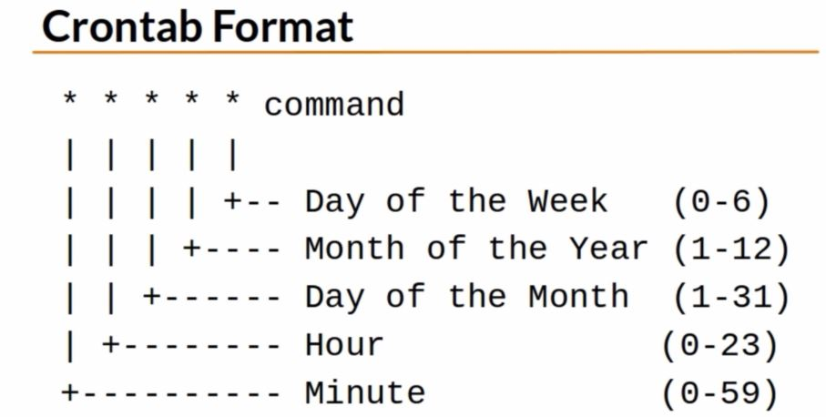

# Linux training

## Linux Command Line Basics

date --> displays current time and date
call -y --> displays the entier calendar of the year
call -y 1990 --> displays the calendar for a specific year
call 1 1995 --> calendar for only one month
call -3 --> previous, current and upcoming
exit --> exit terminal session
ctrl + l --> same as clear

Folder = directory

Direcotry tree

- /
- /etc --> this directory contains system configuration files
- /bin (binary) --> contains executable programs and commands that can be used by all the users in the system; Commands and utilities
- /sbin --> contains programs that performs vital system tasks (network management, disk partitioning). Only the superuser has access to these programs
- /opt (optional) --> commercial software products that are not installed by default in the system (say chromium)
- /home --> each user is given a directory under the home directory.
- /tmp (temporary) --> files that are often changed or deleted (never keep files here)
- /var (variable) --> data that frequently changes over time (log files, dbs)

Linux multiuser environment. 

Current directory: **.**
Parent directory: **..**

Absolute path: begins with the root directory; follows the path branch by branch
Relative path: starts from the current working directory --> "**./**".

- pwd: absolute path name
- ls: list a directory content
  - ls .. --> show contents of parent directory
    +   ls ~
    +   ls /
    +   ls -i : show inode number 
    +   ls -l `<file>`
- cd: change directory
    + cd / : takes you to root directory
    + cd ~ : takes you to your home directory
    + cd .. : go up a level, go to the parent directory
    + cd - : takes you to the previous working directory

Linus Links:

Inode: 
For every file in the system there is an index node (inode). An inode is lika a DB of a file. It contains all file information **except** the file contents and name. Just like a personal ID or passport (withouth a name!).

Inodes contain:

- inode number
- file size
- owner information
- permissions
- file type
- number of links
- ...

There are 2 types of links:

1. soft links: or symbolic links, it's like shortcuts in windows. They are pointers to the original file. They are smaller in file size. An inode number of a soft link is different than the inode number of the original file - if we delete the original file, the softlinks will become useless.

Creating a **soft link** by using de `ln -s` command

- `ln -s orginalFile linkName`

Softlinks:

- they have different inode number than the original
- they have a smaller file size with reference to the original file
- deleting original file makes soft link useless


2. Hard links: a different name of the same file. it's the same file, it has the same file size, same inode number. We can't differentiate between a hard link file and the original file. Like a copy of a file. If the original file is deleted, the hard llinks will still contain the data that was in the original file. Another name o fthe same exact file.

Creating a **hard link** by using `ln` command:

- `ln option originalfile linkName`

Hard links 

- have the same inode number as the original file
- they have the exact same file size as the original file
- if you delete the original file, hard links will not get affected


When we make modifications to either original or hard-linked file, changes are synched.

View inode number:

- ls -i `<filename>`

ls -l

| permission | number of links (hard) | owner | group | file size | last modified | file name |
| ---------- | ---------------------- |-------| ------ | ------ |---------- | ------- |
| -rw-rw-r-- | 1 | joe | joe | 16070 | jul 19 22:49 | espana.md|

We should not create hard links for directories. It's fine to create soft links for diretories.

Creating a _directory loop_ by using soft links.

- dir1
    +   dir2
        *   softlink dir3 points to dir1

- ls -a: this will list all the files in your current working directory including hidden files
- ls -l: long listing - shows many important information
- ls -t: list the files sorted by modification date. Newest first
- ls -r: list the files in reversed fashion; sort files by modification date (ls -tr: modificaiton date oldest first)
- ls -i: list the index node number of each file in the current wd
- ls -R: list the contents of a directory and all it's subdirectories

We can combine flags, for instance: `ls -R -a` or `ls -aR` or `ls -Ra`

Update the timestamp of the file (modification) using `touch <fileName>`. Create a file - touch filename

`mkdir dirName` --> create a directory
`rmdir dirName` --> delete a directory if the directory is empty.
`rm -R` --> for non-empty directories; recursively
`rm -i <filename>` --> asks you if you really want to remove the file
`rm -f <dirName>` --> contrary to the -i, won't ask you for anything, force. Ingnores non-existing files (?)
`rm -v <dirName>` --> verbose, summary of what the RM command did.

### Copy function

`cp <originalFile> <newFile> <destination>`; copying the a directory into another directory: `cp -r <dir> <dir>`

`cp -i` --> interactive, prompts before any override; if file already exists, override?
`cp -v` --> verbose, summary of the command

### Move and rename

- `mv <originalFile> <newName>` 
- `mv <originalFiles> <newDirectoryPath>`
- `mv -i` --> interactive - will ask if you are sure of doing that

### File command

In linux there is no such thing as file extension (pdf, png...), extension of a file has no meaning.

Determine file type: `file <filename>`

### Filenames and spaces

`mkdir my job` --> creates two directories, one named 'my' and another one named 'job'. there are 3 ways of including spaces on naming a file:

1. `mkdir 'my job'` --> using simple quotes
2. `mkdir "my job"` --> using doble quotes
3. `mkdir my\ job` --> escape character **<\>** - precede any space with a back slash

### Special characters

Precede special character with **<\>**; it's telling the shell that the next character has no speciall meaning.

Special characters:

- $
- &
- <|>
- |
- "", ''
- \
- ;

### Shortcuts

- ctrl + a --> go to the frist part of your command
- ctrl + e --> end of the line
- ctrl + d --> delete cursor characters
- ctrl + b --> backwards (same as arrows)
- ctrl + f --> forward (same as arrows)
- ctrl + u --> delete everything from the cursor to the beginning
- ctrl + k --> delete everything from the cursor to the end
- alt + f --> move one word at a time forwards
- alt + b --> move one word at a time backwards
- alt + u --> changes a word to upper case
- ctrl + y --> undonde

### Nano

^ --> ctrl

-----------------------

`history` --> shows history of commands
repeat a command --> `!commandNumber` on the history command

`history 10 | 20` shows the last 10 or 20 commands

Edit history of commands. In your home directory, we have a file named **.bash_history** (machine has to be rebooted for changes to take effect).
Clear history: `history -c`

`less <fileName>` --> for viewing text files (**q** exists the viewing program).

- q : exit
- h : help
- spacebar: one page down, scroll forward one space
- b : scrolls back one page
- g : beginning the file
- G : final of the file
- /word : search for everytime the word appears; **n** goes to the next

`tac filename` --> same as cat but reverse order
`head` --> by default views only the first 10 lines of the file. `head -n 20 <fileName>` shows 20 first lines.
`tail` --> same as head but the last lines rather than the first.
`wc <fileName>` --> word count. used to see information about files (words, how big...). the out would look like this
| line number | word number | byte/character numbers | 
| ------ |------ | ------- |
| 1 | 6 | 28 |

- wc -l --> only shows lines
- wc -w --> only shows number of words
- wv -c --> only shows number of bytes
- wc -L --> shows the amount of characters on the longest line

### Help yourself

There are 4 categories of linux commands:

1. executable programs

Found on the /bin or /usr/bin directories. One of the most famous commands is cp command. 

2. shell builtins

cd command

3. shell scripts

Code - also found on /bin or /usr/bin

4. alias

Your own commands. Built from other commands. For instance, **ls**

Identify command type: `type command`

Which command: how to display executable command location. Shell scripts are executables; alias commands are also executable. The only category or type that is not considered executable is the shellbuiltin commands.

Most executables are in the `bin` or `usr/bin` directories and `/sbin` (super user commands).

`which` is used to display the location of an executable file. `which command`

help shellBuiltinCmd | man cal

whatis --> brief description for executable programs. `whatis cp | ls | head | tail | date | cal`

### Make your Own Commands

Execute several commands in one line:

1. **;**: command ; command....; wrong input commands will be ignored, will only execute OK commands.
2. **&&**: command && command....; it performs a short circuit evaluation (it will execute normally until it encounters an error; all other commands afterward will be ignored).

Wildcards: a symbol that represents one or more characters:

1. `*`: represents any character. `cp * <folderName>`, `cp file* <folderName>` all files that start with file* | `cp *.txt <folderName>` all files that end in .txt | `cp n*e dir1` any file that starts with _n_ and ends with _e_.
2. `?`: represents a **single** character.

Create aliases

1. check if the alias already exists: `type test` - if something like this "test is a shell builtin" is returned, that means that this is already a command, an alias and we cannot use it. Otherwise, we would get "bash: type: XXXX: not found", we can use it
2. `alias <newcommandname>="<executable comands>"`
3. keep aliases after session is closed: save the alias to .bashrc

Show all aliases: `alias`

Delete aliases: `unalias <aliasName>`

## Linux Administration Bootcamp Go from Beginner to Advanced

Kernel: core or heart of the OS; layer between the hardware and the applications.

- / --> root - top branch
- /bin --> binaries and other executable programs (not in machine code)
- /etc --> system configuration files
- /home --> home directories; multiple users have their users in the 
- /opt --> optional or third party software, not bundle in the OS
- /tmp --> temporary space; typically cleared on reboot
- /usr --> user related programs
    +   /usr/bin --> binaries and other executable programs
    +   /usr/lib --> libraries
    +   /usr/local --> locally installed software that is not part of the base OS
    +   /usr/sbin --> SA binaries
- /var --> variable data, most notably log files
    +   /var/log --> log files
- /boot --> files needed to boot the OS
- /cdrom --> mount point for CD-ROMs
- /media --> mount point for different kinds of removable media
- /cgroup --> control groups hierarchy
- /dev --> device files, typically controlled by the OS and the system administrators
- /export --> shared file systems
- /lib --> system libraries
- /lib64 --> system libraries, 64 bit
- /lost+found --> used by the file system to store recovered files after a file check has been performed
- /mnt --> used to mount external file systems
- /proc --> provides info about running processes
- /root --> home directory of the root account
- /sbin --> SA binaries
- /selinux --> used to display information about SELinux
- /srv --> data which is served by the system
- /srv/www --> web server files
- /srv/ftp --> ftp files
- /sys --> used to display and sometimes configure the devices known to the linux kernel

Application (i.e., crashplan) directory structures:

Typically found on /opt or /usr/local

- /usr/local/crashplan/bin
- /usr/local/crashplan/etc
- /usr/local/crashplan/lib
- /usr/local/crashplan/log
- /opt/<app>/bin
- /opt/<app>/etc
- /opt/<app>/lib
- /opt/<app>/log
- /etc/opt/<myapp>
- /opt/<myapp>/bin
- /opt/<myapp>/lib
- /var/<opt>/myapp
- /usr/local/bin/myapp --> shared
- /usr/local/etc/myapp.conf
- /usr/local/lib/libmyapp.so -->
- /opt/<orgName>
- /opt/<orgName>/bin
- /opt/google/chrome
- /opt/google/earth

The Prompt:

[username@linuxmachine ~]**$** --> regular user
[username@linuxmachine ~]**#** --> root user

~jason = /home/jason

Not all accounts are associated to users - services might also have their own accounts (~ftp = /srv/ftp)

Man pages

- Move down one line: enter
- move down one page: space bar
- go back to top: g
- go to bottom: G
- quit: q

Environmental variables store informacion; ypically uppercase.

PATH: it's an environment variable, controls the command search path and contains a list of directories that are separated by a comma. When you type a command at the prompt and press enter, that command is searched for in the directories that are listed in the PATH environment variable.

`which`: location or path of the command

If there are two commands that have the same name, the command that gets executed first is the one that is on the directory that first appears on the PATH environment variable.

Searching Man Pages: `man -k SEARCH_TERM`

`$OLDPWD` : displays the previous directory we were in; to use it, we use `cd -`

`./command` : execute a command in this directory

`mkdir -p carpeta1/carpeta2/carpeta3` : creates depth whitin the path

- ls -l (sort by rime)
    +   Permissions      -rw-rw-r--
    +   number of links         1
    +   owner name      json
    +   group name      users
    +   number of bytes in the file/size        10400
    +   last moditication time
    +   name
- ls -F --> type of file
    +   @ link
    +   / directory
    +   * executable
- ls -t: list files by time
- ls -r: reverse order
- ls -latr: long listing including all files reverse sorted by time
- ls -R: list files recursively
- tree -d : list directories only (visual ouput)
- tree -C: colorize output
- ls -d : only directory name, not contents
- ls --color: colorize output

Symbolic lynks:

- a link is a point to the actual file or directory
- use the link as if it were the file
- a link can be used to create a shortcut
    +   use for long file or directory names
    +   use to indicate the current version of software
 
| Position | Symbol | Type |
| ----- | ---- | ----- |
| 1 | - | Regular file |
| 1 | d | Directory |
| 1 | l | Symbolic link |
| | **r** | read |
| | **w** | write |
| | **x** | execute |

| Permission | File | Directory |
| --- |--- | --- |
| r | allows a file to be read | allows file names in the directory to be read | 
| w | allows a file to be modified | allows entries to be modified within the directory |
| x | allows the execution of a file; you can run it as a program | allows access to contents and metadata for entries |

Category of users:

| Symbol | **Category** |
| --- |--- |
| u | user who owns the file |
| g | group |
| o | other - not the owner and not in a group |
| a | all |

Groups:

- Every user is in at least one group, their primary group.
- Users can belong to many groups.
- Groups are used to organize users.
- the `groups` command displays a user's groups.
- You can also use `id -Gn`.

**-rw-r--r--**

| type | user/owner | group | other/all users |
| --- |---- |----| ---- |
| 1 | 2, 3, 4 | 5, 6, 7| 8, 9, 10 |

Permissions are also known as _modes_. Changing permissions:

| item | meaning |
| ---- | ----- |
| chmod | change mode command |
| ugoa | user category - user, group, other, all |
| +-= | add, substract, or set permissions |
| rwx | read, write, execute |

```bash
# adding
chmod g+w <fileName>
# substracting
chmod g-w <filename>
# more than one at a time
chmod g+wx <filename>
# for more than one category
chmod u+rwx,g-x <filename>
# change all
chmod a=r <filename>
# give no permissions, remove permissions
chmod o= <filename>
```

Numeric based permissions

| r | w | x | |
| ---- | ----- |-----| -----|
| 0 | 0 | 0 | value for off |
| 1 | 1 | 1 | binary value for on |
| 4 | 2 | 1 | base 10 value for on |

Octomode

| Octal | binary | string | description |
| ---- | ---- |---- |-----|
| 0 | 0 | --- | No permissions |
| 1 | 1 | --x | execute only |
| 2 | 10 | -w- | write only |
| 3 | 11 | -wx | write and execute (2+1) |
| 4 | 100 | r-- | read only |
| 5 | 101 | r-x | read and execute (4+1) |
| 6 | 110 | rw- | read and write (4+2) |
| 7 | 111 | rwx | read, write, and execute (4+2+1) |

In permissions, order has meaning

| | U | G | O |
|--- |--- | ----|-----|
|Symbolic | rwx | r-x | r-- |
| Binary | 111 | 101 | 100 |
| Decimal | 7 | 5 | 4 |

`chmd 754 <filename>`

Most commonly used permissions:

| Symbolic | Octal | |
| --- |---| --- |
|-rwx------| 700 | only the owner has access to the file |
| -rwxr-xr-x| 755 | everyone can execute the file - only the owner can modify it|
| -rw-rw-r--| 664 | | 
|-rw-rw----| 660 | some can modify it some others can't |
|-rw-r--r--| 644 | all can read - only owner can modify it |

When you create a file, it's set to your primary group; the `chgrp` command changes the group.

Permissions on a directory can effect the files in the directory. If the file permissions look correct, start checking directory permissions. Work your way up to the root.

File creation mask: determines default permissions; if no mask were used permission would be:

- 777 for directories
- 666 for files

`umask [-S] [mode]`

- sets the file creation mask to mode, if given
- use -S for symbolic notation
- umask takes away permissions, it's a subtraction - it's an estimation
- Common umask modes:
    +   022
    +   002
    +   077
    +   007

| | Diretory | File |
| --- |---|---|
|Base permission | 777 | 666 |
|substract Umask | -022 | -022|
|Creation permission | 755 | 644 |
 
| | Diretory | File |
| --- |---|---|
|Base permission | 777 | 666 |
|substract Umask | -002 | -002|
|Creation permission | 775 | 664 |

Special modes: it's another class

- setuid
- setgid
- sticky

Special modes are declared by prepending a character to the octal mode that you regularly use with umask or chmod

- `find [path...] [expression]`: if we run it empty, finds everything in your pwd and below. Performs a search in real time.
    + -name pattern: find files and directories that match pattern
    + -iname pattern: like -name, but ignores case
    + -ls : performs ls on each of the found items
    + -mtime days : finds files that are days old
    + -size num : finds file that are of size num
    + -newer file: finds files that are newer than file
    + -exec command {} \; : run command against all the files that are found

```bash
# search for anything that ends in *v in /bin
find /bin -name *v
# search for anything that is older than ten days but less than thirteen days old in the pwd
find . -mtime +10 -mtime -13
# bigger than 1M (megabite), 1G, 1K...
find . -size +1M
# search every directory that is newer than a certain file
find . -type d -newer file.txt
```

Locate: `locate pattern`. similar, faster than the find command; not in real time

Look at files in real time: `tail -f fileName`

Display the contents of a file:

- cat 
- head
- tail
- more
- less

### VI

Command mode and navigation; search, paste text, copy text, delete text...

- k     up one line
- j     down one line
- h     left one character
- l     right one character
- w     right one word
- b     left one word
- ^     beginning of the line
- $     end of the line
- x     delete a character
- dw    delete a word
- dd    delete a line
- D     delete from the current position
- r     replace the current character
- cw    change the current word
- cc    change the current line
- c$    change the text from the current position
- C     same as c$
- ~     reverse the case of a character
- yy    yank, copy, the current line
- y<position> yank the <position>
- p     paste the most recent deleted or yanked text
- /<pattern> start a forward search
- ?<pattern>     start a reverse search     

Insert mode

- i : insert at the cursor position
- I: insert at the beginning of the line
- a: append after the cursor positoin
- A: append at the end of the line

Line mode

- :w: writes (saves) the file
- :w! : forces the file to be saved
- :q : quit
- :q! : quit without saving changes
- :wq! : quit and save
- :x : same as :wq
- :n : go to line n (say :15 goes to line 15)
- :$ : positions the cursor on the last line
- :set nu : turn on line numbering
- :set nonu : turn off line numbering
- :help [subcommand] : Get help

Repetition of tasks:

- 5k : move up a like 5 times
- 80i<text> : insert text 80 times

### Emacs

| command | action| 
| ---- | ----- |
| emacs [file] | edit file |
| `C-<char>` | ctrl while pressing `<char>`|
| `M-<char>` | "Meta" key (**alt key**) while presing `<char>`|
| `M-<char>` | Esc, then type `<char>`|
| C-h | help|
| C-x C-c | exit|
| C-h t | gilt-in tutorial|
| C-h k `<key>`| Describe key|
| C-p | previous line|
| C-n | next line|
| C-b | backward one character|
| C-f | forward one character|
| M-f | forward one word|
| M-b | backward one word|
| C-a | go to the beginning of the line |
| C-e | go to the end of the line|
| M-< | go to the beginning of the file |
| M-> | go to the end of the file |
| C-d | delete a character | 
| M-d | delete a word |
| C-k | kill (cut) |
| C-y | yank(paste) |
|C-x u | undo |

Copying files

cp source_file destination_file
cp src_file1 [src_fileN...] dest_dir --> multiple files
cp -i --> run in interactive mode
cp -r source_directory destination --> copy src_directory recursively to destination - if it doesn't exist, it will create the directory and copy the files into it.

Moving and renaming files

mv source destination --> move or rename; -i interactive

If we rename a file with the name of a file that already exists, it will override that file.

sort file --> sort text in file aflfabetically; -k F; sort by key. F is the field number; -r sort in reverse order; -u sort unique (removes duplicate lines and only provides unique results);

Bundle files together

tar [-] c|x|t f tarfile [pattern]: create, extract or list contents of a tar archive using pattern, if supplied.

- c create a tar archive: tar cf `<newFileName>.tar` files/dir
- x extrat files from the archive
- t display the table of contents (list) tar tf file.tar
- v be verbose
- z use compression
- f file use this file

Compress files

- gzip compress files
- gunzip uncompress files
- gzcat contactenates compressed files
- zcat concatenates compressed files


- du estimates file usage
- du -k display sizes in kilobytes
- du -h display sizes in human readable format

- tar **z**cf `filename.tgz` directory/file : tar archive that is compressed
- tar ztvf file.tgz work with compressed files

## Intermediate skills

### Wildcards

A wildcard is a character or string used for pattern matching. We can use wildcards to use search patterns that, when expanded will return a list of matching files and directories (globs or glob patterns).

- *: matches zero or more characters; matches anything
- ?: matches exactly one character 
- `[]`: a character class to make specific search patterns. Example
    +   ca[nt]*
        *       can
        *       cat
        *       candy
        *       catch
- `[!]` : exclude characters. Matches exactly one character: [!aeiou]* --> list all files that do NOT start with a vowell.
- ranges: Use two characters separated by a hyphen: [a-g]* all files that start with a,b,c,d,e,f,g.| [3-6]*
- Predefined character classes: [[:alpha:]], [[:alnum:]] (alpha numeric), [[:digit:]], [[:lower:]], [[:space:]], [[:upper:]]; ls *[[:digit:]] --> all files that end with a digit.
- Searching for wildcard characters: `\` escape character: *\? --> match all files that end with a question mark

### I/O

Three types of I/O:

| I/O name | Abbreviation | File Descriptor |
| ---- | ----- |----- |
| Standard input | stdin | 0 |
| standard output | stdout | 1 |
| standard error | stderr | 2 |

By default standard input comes from the keyboard; standard output and standard error are displayed to the screen. File descriptors are just numbers that represent open files.

- `>` redirects standard output to a file; overwrites (truncating) existing contents;
- `>>` redirects standard output to a file; appends to any existing contents
- `<` redirects input from a file to a command
- & used with redirection to signal that a file descriptor is being used
- 2>&1 combine stderr and stdout
- 2>file redirect stderr to a file
- To ignore output, redirect it to nowhere: >/dev/null --> ls here note-here 2> /dev/null

### Comparing files

- diff file1 file2 - compare two files
- sdiff file1 file2 side-by-side comparison
- vimdiff file1 file2 - highlight differences in vim
    +   ctrl-w w : go to next windows
    +   :q      quit (close current window)
    +   :qa     quit all (close both files)
    +   :qa!    force quit all (don't save)

### Searching in files

- `grep pattern file` : look for text in a file; 
    +   `-i` perform a search, ignoring case
    +   `-c` count the number of occurrences in a file
    +   `-n` precede output with line numbers
    +   `-v` invert match; print lines that don't match

file file_name --< display the file type;

Searching for text in binary files: grep is not useful. We have to use the `strings` command.

Chain commands together: `|` it takes the stdout from the preceding command and passes it as the stdin to the following command; if there are error messages, those are not passed. `grep patter file` is the same as `cat file | grep pattern`.

`cut` command allows you to select portions of a file, cut out selected portions of a file. If file is omitted, use standard input. The `-d dilimiter` uses delimiter as the field separator. `-f N` display the Nth field.

grep mail /etc/passwd | cut -d: -f1,5 | tr ":" " " | column -t

tr --> changes a character

### Copying files over the network

- SCP - Secure copy: `scp source destination` , copy source destination. SCP you need to know the files you want to copy before issuing the command.
- SFTP - SSH file transfer protocol: `sftp host` : start a secure file transfer session with host. A more interactive experience where you can examine local files and remote
- `ftp host`: start a file transfer session with host. Not secure, credentials are sent over the network in plain text. 
- WinSCP --> windows only file transfer client

Navigating SFTP: precede commands with **l** to show location locally (my computer, that is). Use `put fileName`  to send the file to the server. `quit` to exit the SFTP session.

Sending files with scp: `scp fileName user@servername:/path`

### Customizing the shell prompt

Setting environmental variables.

- bash, ksh, and sh use $PS1
    +   \d Date in "weekday month date" format
    +   \h hostname up to the first period
    +   \H hostname
    +   \n newline - multiline prompt
    +   \t current time in 24-hour format
    +   \T current time in 12-hour format
    +   \@ current time in 12-hour am/pm hours format
    +   \A current time in 24-hour hours format
    +   \u username of the current user
    +   \w current working directory
    +   \W basename of the current working directory
    +   \$ if the effective UID is 0, a #, otherwise a $
    +   Persist PS1 changes
        *       $ echo 'export PS1="[\u@\h \w]\$ "' >> ~/.bash_profile
- Csh, tcsh and zsh use $prompt

### Aliases

Shortcuts - use for long commands - use for commands you type often

- alias --> display all available aliases
- alias [name[=value]] --> create a new alias

They can be used to correct typos (alias grpe="grep") or to make an environment more similar to another (alias cls="clear"); to remove an alias `unalias name`; to remove all aliases `alias -a`. To make aliases persist, they have to be added to your personal initialization files (for instance .bash_profile)

### Environment variable

Env Vvariable is a storage location that has a name and a value; can change how a program behaves. To see all environment variables, run the `printenv` command. To view the value of a single variable: printenv VARIABLE or echo $variable. Remove variable: `unset VARIABLE`

PATH env variable: the value of the variable affects how a program behaves; the shell uses the PATH to determine what to run and in what order 

Creating a environment variable: `export VAR="value"`; ie `export EDITOR="VI"`

### Processes and Job Control

- ps dispaly currently running processes
    + -e    everuthing, all processes
    + -f    full format listing
    + -u username   display username's processes
    + -p pid    display information for process id
    + ps -eH    display a process tree
    + ps -e --forest display a process tree
- pstree
- top   interactive process list
- htop

PPID : parent process ID

When a program is running on the foreground - the shell will not be displayed until that process finishes or exits. We can run programs in the background. To run a command in the background: `&`; kill a process in the foreground: `ctrl-c`; suspend the foreground process `ctrl-z`, it's stopped. To send a suspended process to the background `bg [%num]` (if no number is provided, bg will kill the ); foreground a background process `fg [%num]`. kill a process by job number or PID `kill`. list jobs `jobs [%num]`.

When we write `kill PID` the default signal that is is sent is the TERMinate signal, which is the same as `kill -15`; `kill -l` displays a list of signals. To use the kill signal with the kill command, use `kill -9 PID`.

```bash
# name of a program
$ ./long-running-program &
[1] 2373
# in brakets we get the job number, that can be referenced with the jobs command and the PID
$ jobs %1
[1]+        running         ./long-running-program
```

The `+` means the current job; `-` previous job. Look at the present job `jobs %%` or `jobs %+`; look at the previous running job `jobs %-`

### Scheduling repeated jobs with Cron

To repeat a task on schedule, we can use the `cron` command. It's a time based job scheduling service that starts when the system boots. Every minute the service checks if there are jobs to run; if so, they run them. It's usually used to schedule maintenance.

We can use the `crontab` command/program to create, read, update, and delete your job schedules.



Example: 

```bash
# Rub every Monday at 07:00
0 7 * * 1 /opt/sales/bin/weekly-report
```

| 0 | 7 | * | * | 1 | /opt/sales/bin/weekly-report |
| ------- | ------ | ----- | ------ | ------ | ----- |
| minute (0-59) | hour (0-23) | day of the month (1-31) | month of the year (1-12) | day of the week (0-6) | program to be run |

0 --> sunday

Output can be redirected to send an email; example to send output to a log file:

```bash
# Run at 02:00 every day and send output to a log file
0 2 * * * /root/backupd > /tmp/db.log 2>&1
# run every 15 minutes 
0,15,30,45 * * * * /opt/acme/bin/15-min-check
# another way of doing the same thing
*/15 * * * * /opt/acme/bin/15-min-check
# run for the first 5 minutes of the hour
0-4 * * * * /opt/acme/bin/first-five-mins
# Crontab shortcuts
@yearly 0 0 1 1 *
@annually 0 0 1 1 *
@monthly 0 0 1 * *
@weekly 0 0 * * 0
@daily 0 0 * * *
@midnight 0 0 * * *
@hourly 0 * * * *
```

- crontab file: install a new crontab from file
- crontab -l: list your cron jobs
- crontab -e: edit your cron jobs
- crontab -r: remove all your cron jobs

### Switching users and running commands as others

- su [username]: change user ID or become superuser if no argument/username is provided
    +   `-` : A hyphen is used to provide an environment similar to what the user would expect had the user logged in directly
    +   `-c` command: specify a command to be executed
- whoami : specify the current user
- sudo: execute a command as another user, typically the superuser; no need to provide the other user account's password; you are asked for your own password.
    +   sudo -l: list available commands
    +   sudo command: run command as root
    +   sudo -u root command: same as above
    +   sudo -u user command: run as user
    +   sudo su: switch to the superuser account
    +   sudo su - : switch to the superuser account with root's environment
    +   sudo su - username: switch to the username account
    +   sudo -s : start a shell
    +   sudo -u root -s : same as sudo -s
    +   sudo -u user -s : start a shell as user
- visudo : Changing the sudo configuration: it edits /etc/sudoers file; root privileges required.
    +   The sudores file contains a list of users and what commands can run those users and as what users can those commands can be run as. For instance: `user host=(users)[NOPASSWD:]commands`, `adminuser ALL=(ALL) NOPASSWD:ALL`, `jaliaga toshiba=(root) /etc/init.d/oracle` 

### Shell history and autocompletion

Shell history can be displayed and recalled; Shell history is stored in memory and on disk:

- ~/.bash_history
- ~/.history
- ~/.histfile

- `history`: displays the shell history
    +   ctrl-r : reverse shell history search
    +   enter : execute the command
    +   arrows: change the command
    +   ctrl-g : cancel the search
- `HISTSIZE`: controls the number of commands to retain in history (`export HISTSIZE=1000`); default 500 commands.
- !N repeat command line number N (! = bang)
- !! repeat the previous command
- !string repeat a command that starts with a letter or word
- `! :N <event> <separator> <word>`
    +   ! represents a command line (or event)
        *       ! = the most recent command line
        *       ! = !!
    +   :N : represents a word on the command line. 0 = command, 1 = first argument, etc
- `!^` represents the first argument; the same as !:1
- `!$` represents the last argument

### Installing and managing software

A `package` is a collection of files. Data/metadata: package description, version, dependencies.

Package manager: installs, upgrades, and removes packages; manages dependencies (identified in the metadata) and keeps track of what is installed. 

- RPM (RedHad Packet Manager) - if we wish to install a packet for one of these systems and it's not included on the default repository we have to either add a repository that contains such package or use the GUI to download the package (look for **.rpm** software - ubuntu software ends with **.deb**, for instance)
    +   RedHat
    +   CentOS
    +   Fedora
    +   Oracle Linux
    +   Scientific Linux
    +   `rpm -qa`: list all installed packages
    +   `rpm -qf /path/of/file` : list the file's package
    +   `rpm -ql package` : list package's file
    +   `rpm -ivh package.rpm`: install package
    +   `rmp -e package`: erase (uninstall) package
- yum is a RPM utility of RPM
    +   yum search string: search for string
    +   yum info [package]: display info
    +   yum install [-y] package: install a package
    +   yum remove package : remove package
- APT (advanced packaging tool) - like RPM but for debian machines. apt-get install/remove/purge package (purge removes configuration files). apt-cache show package (display info). 
    +   dpkg is similar to APT. dpkg -l --> list installed packages; dpkg -S /path/of/file --> list file's package; dpkg -i package.deb (install a package); dpkg -L --> list all packages

## The Linux Boot Process and System Logging

BIOS: Basic input/output system: test the bootloader and OS. BIOS performs a POST (Power-ON Selft Test); checks hardware and loads bootloader. If the test succeeds, the BIOS will try to run the boot loader. Linux bootloaders:

- LILO: Linux Loader - older
- GRUB: GrandUnified Bootloader; replaced LILO

Bootloaders start the OS.

initrd: temporary filesystem that is loaded from disk and stored in memory. It contains helpers (hardware detection) and modules (drivers) required to load the permanent OS FS.

- /boot: the linux kernel, initrd, boot loader config and other files required to boot linux
  - the kernel is typically named `vmlinux` or `vmlinuz` (ending with **z** means it's compressed).

Kernel Ring Buffer: Contains messages from the Linux kernel. A ring buffer is a data structure that is always the same size. Once the buffer is completely full old messages are discarded when new messages arrive. To see the contents of the ring buffer use `dmesg` - these messages are typically also stored on disk on /var/log/dmesg.

Linux has runlevels to determine which processes to start:

| runlevel | description |
| ----- | ----- |
| 0 | shuts down the system |
| 1, S, s | single user mode. used for maintenance |
| 2 | multi-user mode with GUI (debian/ubuntu) |
| 3 | multi-user text mode (redhat/centos) |
| 3 | undefined| 
| 5 | multi-user mode with gui (RH(COS))|
| 6 | reboot |

Traditionally, runlevels were controlled by the `init` program, it's config stored in `/etc/inittab:`. To edit the run lvl, edit the file inittab and set the runlevel on the init default line: `id:3:initdefault`. It's being replaced by **systemd** which uses targets instead of runlevels:

```bash
# cd
/lib/systemd/system
# ls -l runlevel5.target
lrwxrwxrwx. | root root <date> runlevel15.target -> graphical.target
#systemctl set-default graphiclal.target
```

Targets are roughly equivalent to runlevels. You can edit the targets with "systemctl set-default graphiclal.target" or edit the file /etc/systemd/system/default.target.

With the init system you can change runlevels using the `telinit` command (telinit 5). To change the target you can also use  `systemctl isolate TARGET` (i.e., target = graphical.target).

- shutting down
  - telinit 0
  - systemctl isolate poweroff.target
  - poweroff
- rebooting
  - telinit 6
  - systemctl isolate reboot.target
  - reboot
  - shutdown [-r] 15:30 [messsage]; let's the rest of the users that a reboot is going to happen

The syslog standard for message logging:

- aids in the processing of messages
- allows logging to be centrally controoled
- uses facilities and severities to categorize messages

The line that starts with `linux` tells the bootloader which kernel to load. Anything after the location of the kernel is passed to the bootloader as arguments: `linux16 /boot/alkdsfjañlksdjf <ARGS>`.

### Facilities

They are used to indicate what type of program or what part of the system the message originated from:

| Number | keyword | description |
| ----- | ------- | --------- |
| 0 | kern | kernel-messages |
| 1 | user | user-level messages |
| 2 | mail | mail system |
| 3 | daemon | system daemons |
| 4 | auth | security/authorization messages |
| 5 | syslog | messages generated by syslogd |
| 6 | lpr | line printer subsystem |
| 7 | news | network news subsystem |
| 8 | uucp | UUCP subsystem |
| 9 | clock | daemon |
| 10 | authpriv | security/authorize messages |
| 11 | ftp | FTP daemon |
| 12 | - | ntp subsystem |
| 13 | - | log audit |
| 14 | - | log alert |
| 15 | cron | clock daemon |
| 16 | local0 | local use 0 (local0) |
| 16 | local1 | local use 0 (local1) |
| 16 | local3 | local use 0 (local2) |
| 16 | local3 | local use 0 (local3) |
| . | . | . |
| 23 | local7 | local use 7 (local7) |

### Severities

| Code | Severity | keyword | Description |
| 0 | emergency | emerg (panic) | system is unusable |
| 1 | alert | alert | action must be taken immediately |
| 2 | critical | crit | critical conditions |
| 3 | error | err (error) | error conditions |
| 4 | warning | warning (warn) | warning conditions |
| 5 | notice | notice | normal but significant condition |
| 6 | info | info | informational messages |
| 7 | debug | debug | debug-level messages |

Syslog servers accepts log messages and processes them based on rules. Traditionally `syslogd` does that; it's being replaced by `rsyslog` or `syslog-ng`.

- config file for **rsyslog**: /etc/rsyslog.conf:
- include additional config files with `Includeconfig /etc/rsyslog.d/*.conf`. 

Logging rules consist of two fields:

- Selector field: lists the facilities/severities of messages to include in the rule.
  - FACILITY.SEVERITY
    + mail.*
    + mail
    + FACILITY.none
    + FACILITY_1.SEVERITY;FACILITY_2.SEVERITY
- Action field
    + determines how a message is processed (most commonly, to write the message to a log file)

```bash
# matches the facility of mail of every severity
mail.* /var/log/mail.log
```

if the path starts with `-` that tells syslog that it doesn't have to perform a sync operation for each log message- this is sometimes called caching mode. When using caching mode, know that some messages might be lost if a system crashes immediately after a write attempt; you might see a performance improvement during normal operations if you have a system that performs many loggin operations

- Caching vs non-caching
  - caching is used if the path starts with a hyphen
    - mail.info -/var/log/mail.info
  - you may lose some messages during a system crash if your are using caching mode
  - using caching mode can improve I/O performance
