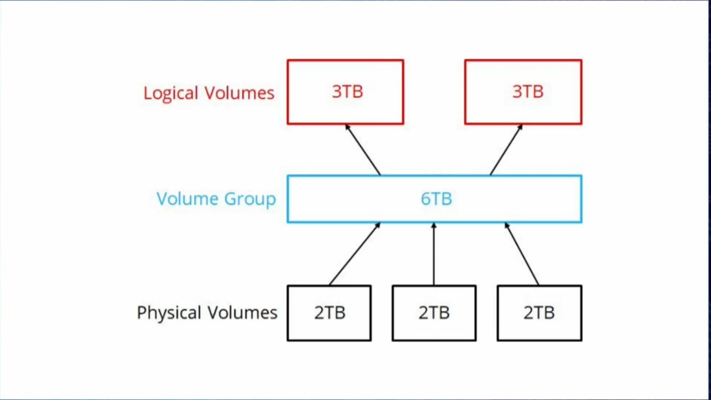

# CompTIA Linux+

<https://dxc.skillport.com/skillportfe/main.action?path=browsecatalog/en-us/_fcpaths_L1NraWxsU29mdFNQOC9JVFNraWxsczEvT3Blcm5nU3lzcnZlcnMvTGludXgx_fcpathe_>

## Introduction to Linux & the Command Line

- Free software: You can view, modify, copy and distribute software. Social movement, focus on User rights
- Open Source: View modify distribute copy - development methodologoy, focus on collaboration; sharing soure code to receive feedback - you can't distribute it freely? as long as you don't make money

Linux is a kernel - software that allows software to talk to hardware. The kernel runs on top of the Hardware.

GNU: Focus on _free_. The entire software is free.

People take GNU software + linux kernel -- > linux distribution. 

### Shell prompt

- $ regular user
- # root

Shell --> bash, zsh, dash

| command | option | args |
| ------- | ------ |---- |
| ls | -la | /bin/sh |

View available shells: `cat /etc/shells`

Super User: make modifications to the system - or to make changes in behalf of the another user.

If there's [] --> optional; if there is no [], that's mandatory.

Using a hyphen when logging in, we are _creating a session_ for that user. You are _fully_ that user; if you don't use the hyphen, you are modifying your session, instead of creating a _new_ session.

Edit hostfiles, edit DNS records --> `/etc/hosts`

su - : create a new session as root.

Who can do sudo? `/etc/sudoers` --> to modify it - use "visudo" instead of sudo. If we see a **%** that means it's a _group_. Check what group you belong to: groups <username>.

| user | which workstattion| = | (which commands) | authenticate? |
| ---- |------ |----- |------ |--------|
| <username/groupname>| ALL| =| (ALL) | ALL|

jdoe    ALL=(ALL)   ALL
jdoe    ALL=(ALL)   NOPASSWD:ALL
%users  ALL=/sbin/mount /mnt/cdrom, /sbin/umont /mnt/cdrom

People on the users group can run mount and umount command cdrom.

Check my group `groups <username>`

- which --> where is that command located

## Managing Users & Groups

- useradd --> add a user. need to be SU. sudo adduser sarah
  - -c --> comment (fullname of the user)
  - -e --> experition date
  - -s --> change shell (/bin/dash)
  - -d --> home folder (/home/jane_smith); needs to be created manually
- sudo id sarah
- sudo userdel <username>: delete user
  - -r removes home directory and files associated
- usermod: modify
  - -c add a comment
  - -l modify the name of the accoumt - sudo usermod -l sjones sarah; the new name for the account is sjones
- passwd <username> : add a password to an account.
- chage --> change user password expiry information
  - chage -l <username>: information about the password

### Default settings when creating an account

useradd -D : see defaults. /etc/skel --> when a new user is created, it takes information from that folder and puts it into the home directory. Modifications only affect new users, not existing users.

`/etc/login.defs` --> login definitions - we got mail box? password age, create home direcotry?+|}

useradd command --> /etc/default check config in there.

/sbin/**nologin** -> have access but not shell

chsh --> change shell

<username>:`X` the x is for the password; we can look at passwords if we look into sudo tail /etc/shadow

In the /etc/shadow we see username + a hash; if they don't have hash, it's because they don't have passwords

| username | hash | date created | starting time | expiration date | warning ahead |
| ------ | ----- |-------- | -------- |--------- |----------|
| zach | ñlakfdjlkñadjfñklajdñfkjasdfk | 17960| 0 | 99999 | 7 |

tail /etc/group --> every time we create a user, we create a group with the same name.

### Groups

Create groups

- sudo groupadd <name>
- sudo groupmod
  - -n change the name (sudo groupmod -n Marketing marketing)
- cat /etc/group
- groupdel

Users have primary group and secondary groups. When we create a user, we create the primary group for that user

- sudo gpasswd -a jdoe Sales : adding a user to Sales
- sudo gpasswd -d jdoe Sales : delete user from Sales
- sudo gpasswd -A jdoe Sales : add jdoe as admin **-A**

When we define a file, we define a User, a group and an other. A user will have certain access to a file, a group, which will usually be a person's primary group may have access to a file and other is anything else.

Establish primary group:

- newgrp Marketing --> do things within another group.
- chgrp

id <username> --> see information on the user

groups --> see the groups you belong to

tail /etc/group

gentent --> find information inside /etc/group and /etc/passwd files.

## File Access & Permissions

|type of object |owner permissions | group permissions | other permissions | 
| ----- | ------- |-------| ----- |
| d or - | rwx | r - x | r - x |

`chmod`

- u user
- g group
- o others

- 4 Read
- 2 Write
- 1 Execute

- `chmod g+w <filename>` add write permission to group
- `chmod o-r <filename>` remove read permissions to other
- `chmod u+x,g+rwx,o-r <filename>` user execute, group read, write and execute, others can't read
- `chmod u=rw,g=rw,o-rwx <filename>` = equals overwrites permissions
- `chmod 660 <filename>` read write for u and g - nothing for o

Default permissions - the uMask. There are permissions that are set at the system level, where the user is not involved (temporary files), others created by users. `.bashrc`, or `/etc/profile`. umask numeric values is backgrads

- 0 read, write and execute
- 1 read and wirte
- 2 read and esecute
- 3 read only
- 4 write and execute
- 5 write only
- 6 execute only
- 7 no permissions

A directory needs the execute permission to be set up so that you can cd into it.

`chown` changes owner and group.

- `chown jdoe:Marketing <fileName>` changes owner to jdoe : marketing group
- `chown :Sales <filename>` change only the group, leave the owner
- `sudo chown -R jaliaga /home/jaliaga/*` make sure you own everything in the home directory; -R recursive

Using .tar as a backup tool saves file permissions.

File system ACL (access control lists) > part of the FS. When the disk is mounted, that's when it determines whether or not it's going to allow these file system ACLs. When the system boots, it looks for a particular file > **/etc/fstab** which contains information on all my disks and were they are mounted on. To enable FACLs, if they are not enabled by default, you can go the fstab file and add, **,ACL**:

-UUID=<numbers> /    xfs     defaults,ACL    0 0

Then you have to unmount and mount the disc; if it's your root partition > reboot.

- getfacl to view the ACL of a file - `getfacl fileName` if nothing is returned, no facl enabled.
- `setfacl`
  - -m > modifiying `setfacl -m u:zach:rw fileName` > adds zach as user and he can read and write; `setfacl -m g:Markeing:rw fileName` adds a group
  - -s > setting

setfacl makes it easier to grant different people access to files (it used to be that only one group and one user could have access, and the rest of categories felt to the other part of the permissions); setfacl allows us to set more granular permissions.

We can also set permissions for directories.

We can see that facl are enabled if we see a **+** sign on a file. ACLs allow for more granular permission settings for FileSystems - The `acl` package is a dependency of **systemd**.

Sticky bit: sometimes, other than rwx-+, we might see a _t_. It is designed for shared folders. Only the _creator_ (or root) can _delete_ the file. The sticky bit keeps track of _who_ creates what.

- chmod o+t,g+t filename

## Disk Partitions & File Systems

Older styled disks: MBR, master boot record. it tells the system all the data spread accross the drive. BIOS loads up and looks for the MBR to find the OS to boot. You are limited to 4 partitions. Home directory in one partition; system on another; swap on another. If we run out of memory, all the memory available in our system, we start using the hard drive as memory.

Since this limit of 4 partitions, people came up with _logical partitions_ or fake partitions _inside_ a primary partition. Inside the primary partition we might have 3 primary and an extended partition, which technically it's a primary partition but it's ready to hold logical partitions. We can exceed the 4 partitions.

GPT GUID partition table: new system that allows 120 paritions on a disk.

### MBR

- lsblk: listblock devices (anything that provides block storage, pendrive, external drives...).
- fdisk: sudo fdisk -l (lists) /dev/sdb - it tells; without options, we start modifying the disk.
  - m - see manual
  - n - create
  - p - see partitions
  - d - delete
  - w - save, write
  - t - to change the partition ID - l to see the which ID to use.

n > p(rimary) > 1 (1-4 partitions) > default or sector > +500G

The ID defines what it's going to be used for - 83 is for Linux. 82 swap parition.

### GPT

- gdisk <disk>

### parted

Does MBR and GPT.

Partitions are useless until you put a FS on top of them. We've created the tables to track the partitions, not the files and folders.

### File System formats

- Centos - default xfs
- Ubuntu - ext4

1. ext4: it has journalling support --> instead of writing directly to a file, you write to a second place on the disk; only when you are 100% done, the information is written to the file (ext3 would write directly to the file; in case of power outage or something, the file could be corrupted). Used be default in Ubuntu
2. xfs: very similar; uses different driver. It has support for long file names... grow and shrink your partition, allows journaling. Used by default in red hat.
3. btrfs: better fs - there are many scenarios that cause data loss; it's cutting edge. Software raid ok. "it's the way of the future". It has raid functionality.
4. zfs: network storage appliances.. not that commonly used; it has a strong following but mainly designed for network storage appliances or clusters doing shared storage

mkfs -> make filesystem; -t -> especifies FS to be used. See all available FSs --> ls /usr/sbin/mkfs*.

- lsblk
- sudo mkfs.fsformat <disk-to-be-formatted> (something like sudo mkfs.ext4 /dev/sdb1). It erases all the data on the disk.

Swap partitions: we don't put a FS format on those partitions. It stores virtual memory so it does not need a FS. we use an utility called **mkswap** --> sudo mkswap /dev/sdb3. It does not go active right away; we have to tell the system to use it --> sudo swapon /dev/sdb3. 

Tuning commands for FS are found under ls /usr/sbin/tune*.

Changing the label of a partition is non-disruptive. *e2e* --> for chaning labels on ext fs. *xfs_admin* --> for changing labels on xfs fs.

- sudo e2label /dev/sdb1 PublicStorage (
- sudo xfs_admin -L PrivateStor /dev/sdb2

We can't actually use a disk until it's _mounted_. Everything in Linux is treated like a file, so the new partition has to be mounted into the FS, in our directory tree. **mount** > lists all the disks on the system. 

```md
- /dev directory contains special files (device files) corresponding to physical devices or system components
- /media is a regular directory which by common practice is used to mount removable media like CD-ROMs, floppy disks, etc. /dev is essential to the operating system and it cannot be removed
- /mnt is a regular directory which by common practice is used to mount other filesystems, usually for a short period of time

/media and /mnt are only a placeholder directories; removing them won't influence the operating system core operation, but might cause errors with certain applications; for example when a removable media is inserted, or when a process tries to mount a filesystem.

As an example of the difference: /dev contains a reference to a physical CD-ROM drive, /mount might contain a subdirectory through which you can access the files stored on the disc inserted to the same CD-ROM drive.
```

Regularly, if you mount something under /mnt, that would be available to all users. To mount something only for a specific user, we can mount it on their /home directory, and that makes it available just for them.

- sudo mount /dev/sdb1 /mnt/Public
- sudo mount /dev/sdb2 /mnt/Private

Use umount /dev/sdb1 or 2 to unmount.

This is temporary - in case of a reboot, all partitions would be unmounted. For them to be persistent, we have to put them into the FS table, which is located in `/etc/fstab`. We can mount using 1) UUID: it stays the same if we move it across systems, 2) paths or 3) labels applied.

- UUID=lñkdljñkdsajlñksdsdflñjk	/		xfs	defaults	0 0
- /dev/sdb1			/mnt/Public	ext4	defaults	0 0
- label=Private			/mnt/Private	xfs	defaults	0 1

The first 0 at the end can either be a 1 or a 0; if we run the **dump** utility, which is an old BUR utility, and the first number is a 1, the partition _will_ be included in the backup - if it's a 0, it won't be included in the backup. Dump utility is not used.

The second 0, identifies the order in which a disk will be checked in the event a FS check occurs. If we change the 0 for a 1, the system will check the disk after the boot process is done; if it's 0, the boot process will stop and check the partition and then move on with the boot process. 

The data in the fstab can be mounted without super user privileges.

##### LAB

You can also find the total space taken by each of the directories: `du -h --max-depth=1`

Each hard disk contains one MBR partition. It is the first sector of the disk and is not large enough to hold more than four partitions. These partitions can be:

- Primary
- Extended
- Logical

There can be a variation on the number of primary and extended partitions that you can define. For example, you can have three primary partitions and one extended partition. Else, you can have one primary and one extended split into three logical partitions and many more.

You can display the partition table using the parted command that shows you the boot partition and its type.

To display the partition table, type the following command:

`sudo parted /dev/sda u s p`

- u - An abbreviation for Unit command.
- s - Refers to the unit Sector, this can be interchanged with the following:  B, KiB, MiB, GiB, TiB, kB, MB, GB, TB, %, cyl, chs, compact.
- p - An abbreviation for Print command.

You can also list the partitions using the fdisk.

To list the partitions, enter the following command:

`sudo fdisk -l /dev/sda`

The -l option in the command above lists the partitions on the /dev/sda device. To format the partition simply use `sudo fdisk <partitionPath>`.


## Logical Volumes & Filesystem Hierarchy

LVM is applied to create virtual disks built on top of physical disks.

Is LVM installed? `sudo yum list lvm*` - the main package we are looking for is the **lvm2**. If it isn't installed `sudo yum install lvm2`. LVM needs disks which will be attached to the LVM system. When we do that we are expecting a partition already on the system.

Inside the LVM there are 3 things we work with (which need to be created):

3. Logical Volumes: then we slice that volume group as we want. LV.
2. Volume Group: gather physical disks together to create a combined pool of storage. VG.
1. Physical Volumes: we might have several physical disks, but they are not considered to be physical volumes. PV. 



To see the tools available we use `ls /usr/sbin/pv*`, for physical volumes, for instance.

```bash
sudo pvcreate /dev/sdb1 /dev/sdc1 # bringing in the parted disks
# we wipe the disks
sudo pvdisplay # show pv
sudo vgcreate vg1 /dev/sdb1 /dev/sdc1 # Create a volume group named vg1 using the physical volumes sdb1 and sdc1, that we created above
sudo lvcreate -L 1500G vg1 -n lv1 # create a LV with 1.5T from vg1 and name it lv1
lvdisplay # show LVs
```

The volume group needs to have a logical name where I can map to. Physical drives are mapped to /dev/<deviceID>. There is a service LVM mapper, which will create map entries for all LVMs. Usually /dev/mapper/<vgname>/<lvname>.

Usually the name is given so that it matches it's pool storage use, what it's going to be used for. `sudo vgcreate <vgName> <physicalVolumes>`.

`lvcreate -L <sizeToAllocateToNewLV> <sourceVG> -n <name>`

- `pvs` > show physical volume sizes    
- `vgs` > show vg
- `lvs` > show lv

We now have to format it: `sudo mkfs.xfs /dev/vg1/lv1` and we have to mount it: `sudo mount /dev/vg1/lv1 /mnt/Storage` or whatever folder we want to use.

We also have to add it to the `/etc/fstab` for the mount point to be persistent. 

### Add Space to VG

`sudo vgextend <vgName> <pv>` --> this extends the VG; then we have to expand the LV: `sudo lvresize -L +1T <lv2expand>`.

RedHat does not recommend resizing a partition - they recommend backing up the data and making a new xfs partition; it can be done, though. For ext4: `sudo resize2fs /dev/vg1/lv1` without options, this commands takes the entire free space of the partition.

### Deleting LVs

1. First unmount:`sudo umount /mnt/Storage`
2. we go from LV to GV to PV- run `sudo lvremove /dev/lv1`; `sudo vgremove /dev/vg1`; `sudo pvremove /dev/sb1 /dev/sdc1 /dev/sdd1`.

### FS Hierarchy Standard

FHS - filesystem hierarchy standard. 

- /bin: essential cli utilities available to all users. Essential for a system to work, for the operation.
- /sbin: administrative commands. Required for the system to boot up.
- /usr/bin: the rest of the the user commands that are not considered essential.
- /usr/sbin: for the kernel to use but non-essential

These are all related to the system operation, not so much optional commands. Regularly /boot is a separate partition.

- Every program that we run is represented in /proc as a file - inside we have 'virtual files'.
- /sys --> info about the system, hyper-v?
- /usr shared libraries
- /var logs, print spool 


## Using vi/vim to Edit Files

## Locating & Manipulating Files

Binaries we "can't read" - 

- dmesg - hardware; when i plugin a USB device, a log entry is created on the **dmesg**. 
- cp -r <originalFile> <newFileLocation> (with the move directory, you don't need to add the -r, it works just fine without it.
- Touch command to update the time stamp of a file
- find - more useful (?). looks for filenames - not very fast. find PATH -name filename 2>/dev/null . -perm +rwx --> search files with permissions rwx; -rwx those that are not rwx. search by size: find / -size +5M 2>/dev/null . find / -user root. find /home/ -name XXXX -maxdepth 1
- locate - searches mlocate database. it has a db of the files on the machine. it is not updated automatically, it happens once a day or sth. information might not be updated.
- whereis <command> - shows all reasults 
- which - only shows the first instance
- type - what type of function a command is considered - sometimes we don't have 

## Searching & Manipulating File Contents

Searching with grep. regex, escaping character - `\`. egrep - used for advanced regex search. reguarly, grep is aliased to fgrep, most common.

Grep can look into files or directories. -r option to perform recursive search, that is, including subdirectories. `grep -r hola /home/joe`. 

`grep -E "hola|adios`

grep -E == egrep

Manipulating text in files - 09:11

## Boot Process & Kernel

## Graphical User Interfaces

## Managing Services

## Troubleshooting Services

## Managing & Configuring Hardware

## TCP/IP & Networking

## Troubleshooting Network Connections

## Installing and Managing Software

## Installing Software from Source Code
