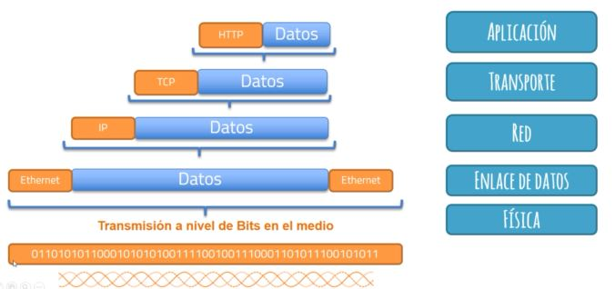
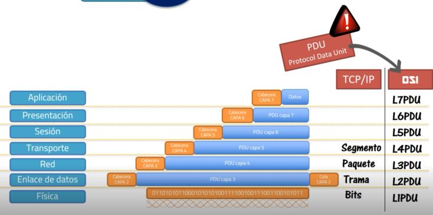

# Network

- Equipos finales - hosts
- Equipos de red - switches, routers...
- Enlaces - cables
- Protocolos: conjunto de reglas que permiten la comunicación entre dos dispositivos - regulan la comunicación para que sea funcional
- Estándares: especificaciones que definen algo - cómo debe ir la conexión, el pineado de un cable si es cruzado o plano; orden de los colores que tiene que ir conectado en cada pin.

Conjunto de normas o reglas que permiten que la red funcione de una forma coordinada, que todos hablen el mismo idioma

## Modelos de red

Modelo de red: conjunto de documentos que **definen** el funcionamiento de una red.

- Modelo TCP/IP: conjunto de protocolos que permiten la comunicación entre dispositivos; los protocolos están especificados en documentos  (RFC)

Segmentamos el modelo en capas en función de la tarea de cada protocolo:

    - Aplicación
        - POP3
        - SMTP
        - HTTP
        - SSH
        - FTP
        - DNS
    - Transporte
        - TCP
        - UDP
    - Internet: que la información generada llegue a destino
        - IP
        - ICMP
        - OSPF
    - Enlace
        - Ethernet
        - ATM
        - Frame Relay
        - PPP
        - FDDI

Los modelos, en general, segmentan las funciones y las agrupan en capas. Las primeras capas se centran en la parte de la aplicación que requiere enviar o recibir datos - las partes inferiores se encargan del envío de la información en el medio físico (cable, aire, bits).

- OSI
    + aplicación
    + presentación
    + sesión
    + transporte
    + red (switch de capa 3, layer 3, L3)
    + enlace de datos (switch de capa 2, L2...)
    + física --> diagnósitco más preciso

#### TCP/IP capas

##### Capa de aplicación

Definen servicios que proporcionan servicios a las aplicaciones. **No define la aplicación en sí, solo _SERVICIOS_ que dichas aplicaciones necesitan**. Por ejemplo, el protocolo definido para las aplicaciones web es el protocolo HTTP. Este protocolo lo que hace es definir los _SERVICIOS_ que después van a utilizar las aplicaciones, en este caso, el servidor web y el navegador web. Es decir, el mismo protocolo es usado por distintas aplicaciones.

Arquitectura/modelo cliente servidor - tiene dos roles:

1. cliente: usuario del servicio - el equipo que está ejecutando un navegador web. El cliente pide (GET)
2. servidor: ofrece el servicio. El servidor responde a la petición. 

¿Qué hace la capa de aplicación en una petición web? la capa de aplicación define la forma en la que hay que seguir una conversación entre navegador y servidor. El protocolo define el lenguaje y las peticiones y respuestas posibles.

En la cabecera, que forma parte del paquete, debe ir un GET y cuando el servidor responda, si encuentra la página, en la cabecera debe ir  un OK (200), seguido de los datos (home.html).

Tiene muuuuchos protocolos.

##### Capa de transporte 

Dos protocolos: TCP (Transmission Control Protocol) y UDP (User Datagram Protocol). Estos protocolos proporcionan servicios a los protocolos de la capa de aplicación, que es la capa superior(**esto en realidad ocurre en todo el modelo, las capas inferiores proporcionan servicios a las capas superiores**). La capa de transporte porporciona varios servicios: 

- Recuperación de errores: si durante la transmisión de los paquetes, hay algún error, el protocolo TCP hace que capa paquete tenga un número de identificación, un número de _sequencia_. Si le falta alguno, se da cuenta de que le falta algo, y hace una petición para que lo reenvíen. El mensaje es del tipo `ACK=<id del paquete faltante>`. El paquete debería retornar el paquete faltante.
    Detecta errores, y los corrige.
- control de flujo
- multiplexación

Hemos visto hasta ahora _interacciones entre capas, a nivel de capas adyacentes_; también _interacciones al mismo nivel de capa_, entre el navegador y el servidor. Se hacen a nivel de cabeceras y permite la comunicación entre capas de un extremo al otro.

##### Capa de red

En la capa de red tenemos un solo protocolo: IP. Funciones de direccionamiento y de enrutamiento.

- Direccionamiento: función que permite que cada equipo, en realidad, cada interfaz de red tenga una dirección única y agrupable. Vamos a tener direcciones que forman parte de un mismo grupo de direcciones.
- Enrutamiento: función de los routers, de los equipos de capa de red, que toma la información recibida por una interfazy enviarla a otra interfaz distinta --> reenvío/forwarding. Tiene que decidir qué otro ruter usar para que llegue lo más rápido posible --> routing. 

Para que la información llegue a destino, la capa de red usa las direcciones. una cabecera con los datos que nos interesan, entre ellos la dirección IP. 

| IP | TCP | HTTP | DATOS |
| --- |--- | ----- |---- |
| IP | SEQ = 1 | OK/200 | PÁGINA WEB |

Esto es conocido como **PAQUETE IP**.

##### Capa de enlace de datos y física

Se encarga de la comunicación entre equipo y equipo, no tanto a nivel del trayecto, si no la parte "pequeña" de este trayecto. Añade a las capas superiores una cabecera. El protocolo ethernet pone una cabecera _y una cola_:

Cabecera Eth | paquete ip | Cola Eth - 011010100110100101010101001

Después pasa esta información a la capa física. La capa física transmite los ceros y unos a la red.

- Capa física: funciones relacionadas con la transmisión física en el medio
- enlace de datos: protocolo y normas de control de **acceso** y uso del medio. Como envío información a través de la red. Que dos equipos envíen información a la vez.

### Encapsulación

Flujo de información entre capas y entre equipos. 

#### Envío de datos

Todo empieza cuando la aplicación desea enviar ciertos datos. Lo que hace es usar algunos de los protocolos que le ofrece la capa de aplicación para enviar esa información y de acuerdo a ese protocolo añadir a una cabecera con información relativa a esa capa (si es HTTP, podría ser un GET, OK, POST...). Lo importante es que se añade cierta información a los datos. A esta información añadida se la llama _CABECERA_.

Esta información se pasa a la siguiente capa, la de transporte. La capa de transporte lo trata a todo como datos y a estos datos le añade su propia cabecera, la cabecera de la capa de transporte (por ejemplo, una cabecera TCP).

Este conjunto de cabeceras más datos se pasa a la siguiente capa, que es la de red. Hace lo mismo, considera a la información que trae la  capa superior como un conjunto de datos a la que añade una cabecera, según el protocolo IP y lo pasa a la capa siguiente.

La capa de enlace de datos añade la cabecera y la _cola_ de de su protocolo, Ethernet, por ejemplo.

Por último, la capa de enlace de datos pasa la información a la capa física que se encarga de transmitir este conjunto de bits en el medio. 

Encapsulación: proceso donde cada capa añade información correspondiente a su protocolo a los datos que recibe de la capa superior.

#### Recepción de datos

Obviamente, el proceso arranca en el orden inverso. La capa física recibe la señal eléctrica y la transforma a bits; este conjunto de bits pasará a la capa superior, el enlace de datos, que es capaz de distinguir la cabecera correspondiente a su capa y la cola y es capaz de tomar las decisiones correspondientes; una vez leída la cabecera y corroborado que la información es correcta, quita la cabecera (y la cola) y pasa esa información, los datos, a la capa superior; la capa de red hace el mismo proceso, identifica la cabecera que corresponde a su protocolo, toma las acciones que le correspondan y posteriormente, si decide que debe seguir procesando dicho paquete enviaría la información a la capa superior, pero primero quita la información correspondiente a su capa; la capa de transporte recibe los datos, identifica la cabecera TCP, la procesa y pasa los datos restantes a la capa superior, la aplicación que hace lo mismo, procesa la cabecera HTTP y pasa los datos finalmente a la app. 

Desencapsulación: proceso de ir sacando cabeceras y pasándola a la capa superior.

Al conjunto de la cabecera y los datos se lo llama según la capa:

- Transporte: segmento / packet segment
- Red: paquete / packet
- enlace de datos: trama / frame
- física: bits

### Modelo OSI:

- Aplicación:
    + interfaz entre la propia aplicación y la red
    + no sirve a otras capas, sólo a la APP
    + provee a la APP un protocolo que le sea útil
    + Ejemplo: navegadores WEB - HTTP - GET
- Presentación:
    + proporciona a la capa de app un formato de datos común
    + responsable de la comprensión y el cifrado
    + asegura que la información que se envía a la capa de aplicación se pueda leer
    + define en qué idioma se envían los datos
- Sesión
    + gestiona las sesiones entre dos hosts
    + sincroniza el diálogo entre las capas de presentación
    + administra el intercambio de datos
- Transporte
    + establece, mantiene y finaliza las conexiones entre hosts
    + detección y recuperación de errores
    + control de flujo (cuánta información se envía en cada momento) en función del rendimiento de la red
- Red
    + conectividad entre redes distintas
    + selección de ruta - enrutamiento
    + direccionamiento lógico
- Enlace de datos
    + acceso a un medio físico determinado
    + detección de errores
    + direccionamiento físico
- Física 
    + define las especificaciones físicas (eléctricas, codificación, modulación de la luz...) para utilizar el medio físico y enviar las señales que contienen la información.

En las **tres** primeras capas encontraremos estaciones de trabajo, servidores, teléfonos IP/móviles, firewalls, dbs. Encontramos los protocolos que van a usar las aplicaciones para comunicarse con la red (HTTP, SMTP, POP3, FTP...).

Cuando hablamos de equipos de capa 7, hablamos de equipos que trabajan en las 7 capas del modelo. Es decir, un equipo de capa X trabaja al nivel de esa capa y de las inferiores.

Capa 4, de transporte, tenemos los mismos equipos, no hay una serie de equipos que sean característicos de esta capa; los protocolos que la capa 4 son TCP o UDP.

Capa 3, capa de **red: el router** que es el que se dedica a interconectar redes distintas y el protocolo más importante es el protocolo **IP**. Existen otros protocolos son ICMP, OSPF que se basan en el IP.

Capa 2, **enlace de datos: el switch**. Da conectividad y acceso a la red a los equipos cableados. También se encuentran en esta capa los **access points** que realizan la conectividad a nivel inalámbrico. El protocolo más conocido es el protocolo Ethernet; pero existen otros como PPP o HDLC.

Capa 1, física: cables, señales de radio, ópticas, eléctricas. Los estándares que los regulan son ETHERNET, TIA/EIA 568-B, 802.3an, 100BASE-T.

En el modelo OSI, la información que se transmite recibe el nombre de PDU (protocol data unit). PDU hace referencia a las unidades de datos que en que trabaja cada capa.

`L<#DeCapa>PDU` - L de layer

